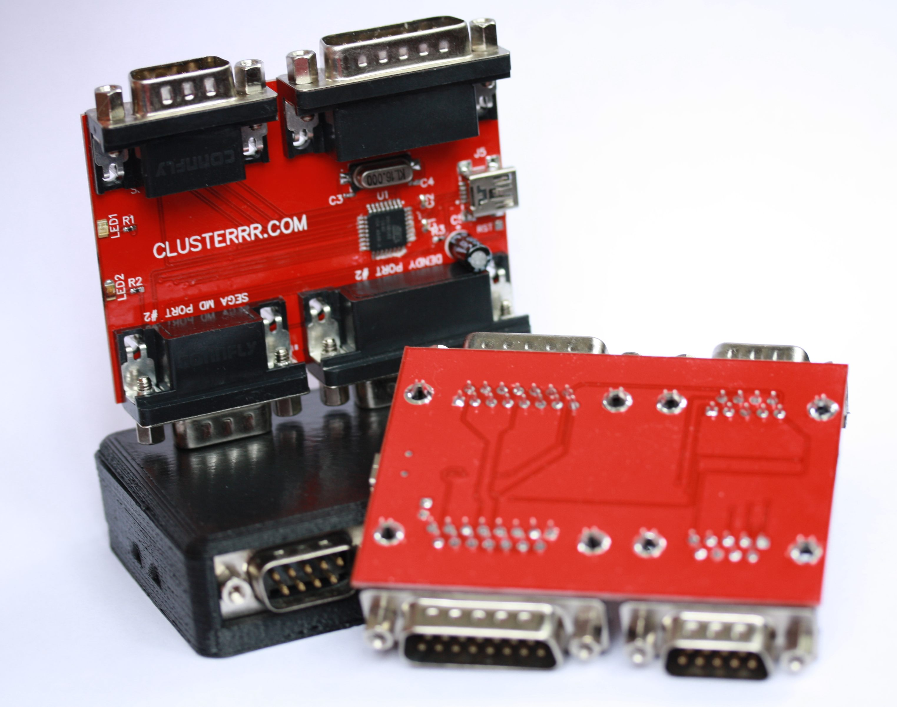
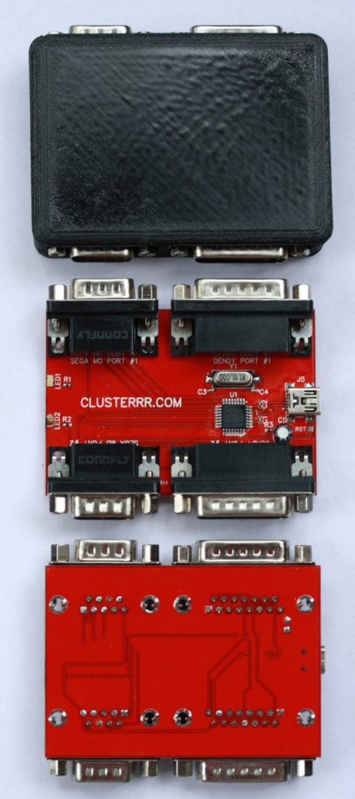
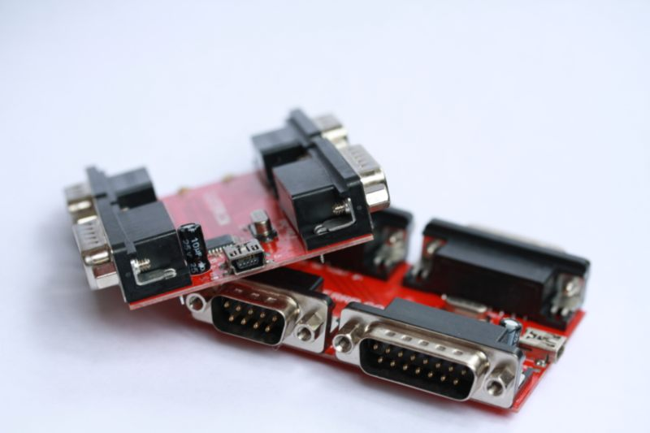
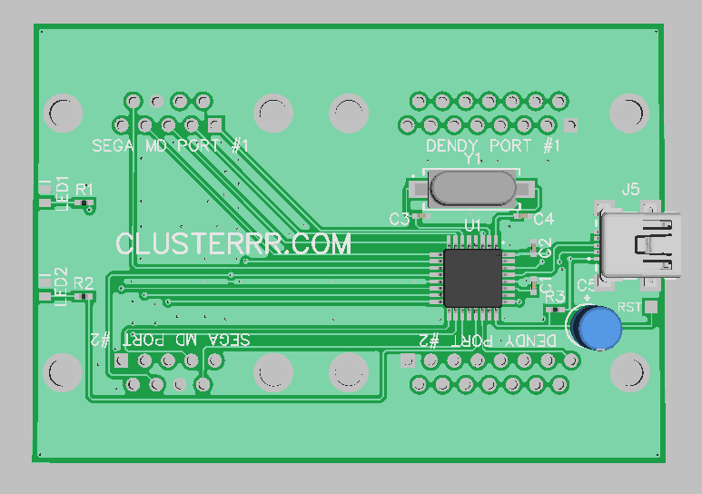

# nessmd2usb
Переходник для одновременного подключения к компьютеру по USB двух контроллеров от Dendy и двух от Sega Mega Drive.

Переходник очень легко собирается и прошивается без использования программатора. Однако, плату лучше заказать на заводе, необходимые файлы лежат в директории "board", включая герберы.

## Необходимые компоненты

- **U1** - AT90USB162
- **J5** - miniUSB разъём
- **Y1** - кварцевый резонатор на 16MHz
- **C1** и **C2** - конденсаторы на 1uF
- **C3** и **C4** - конденсаторы на 22pF
- **C5** - электролит на 4.7uF
- **R1** и **R2** резисторы на 200 Ом
- **LED1** - **LED2** - светодиоды, первый указывает об успешной инициализации, второй о нажатии на любую кнопку
- **R3** - резистор на 1 кОм (номинал не сильно принципиален)
- Два угловых разъёма DB-9 и два угловых разъёма DB-15

## Как собрать и прошить прошивку

Для сборки необходима библиотека [LUFA](http://www.fourwalledcubicle.com/LUFA.php) и компилятор [WinAVR](http://winavr.sourceforge.net/), но скомпилированная прошика уже есть в репозитории - "**[nessmd2usb.hex](nessmd2usb.hex)**".
Прошивается микроконтроллер прямо по USB приложением [FLIP](http://www.atmel.com/tools/FLIP.aspx). Для перевода устройства в режим прошивки нужно замкнуть площадку "**RST**", например на корпус USB-разъёма, рядом с которым она и расположена.

## Как использовать

Устройство работает без дополнительных драйверов. Под Windows оно видится как четыре игровых контроллера. Под Linux и MacOS скорее всего понадобятся танцы с бубном, некоторые версии Linux не понимают четыре джойстика в одном HID-устройстве с одинаковым типом осей. Для них рекомендуется собрать прошивку, раскомментировав дефайн "*LINUX_WORKAROUND*" в файле "*defines.h*". 

Контроллеры от Денди поддерживаются как с широким (15-пиновым) разъёмом, так и с узким (9-пиновым) разъёмом. Последние можно включать в гнёзда для Сеги. Если переходник видит, что контроллер от Сеги не подключен, он пытается работать с контроллером от Денди в этом же порту. Т.е. можно подключить:
- Два контроллера от Денди с широким разъёмом + два контроллера от Сеги
- Два контроллера от Денди с широким разъёмом + два контроллера от Денди с узким раъёмом
- Два контроллера от Денди с широким разъёмом + контроллер от Сеги + контроллер от Денди с узким раъёмом

Т.е. любые комбинации всего, что втыкается.

## Корпус

В директории "**[case](case)**" есть STL файлы для печати корпуса на 3D принтере.

## Купить

Вы так же можете купить у меня уже готовый переходник с напечатанным корпусом за **1500 рублей**. Пишите мне на clusterrr@clusterrr.com или в VK: [http://vk.com/clusterm](http://vk.com/clusterm)

Так же за какую-нибудь символическую цену можно купить у меня уже готовые платы для самостоятельной сборки.
