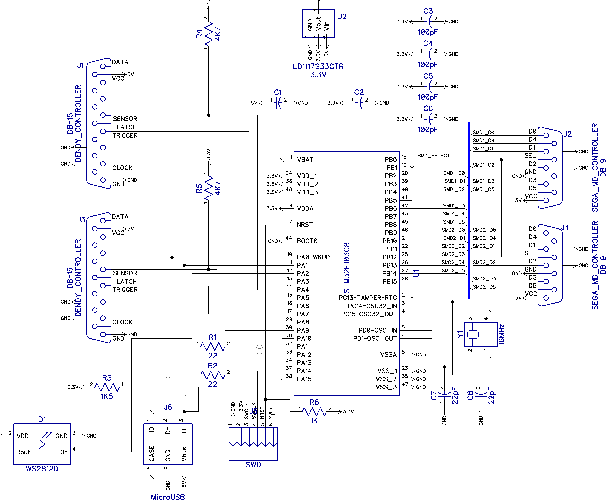

# nessmd2usb
This adapter allows to connect Sega Mega Drive (Sega Genesis) and Famiclone (9-pin and 15-pin) controllers to PC via USB. Also it allows to connect 15-pin Famicom Light Gun (or clones) and use it with [fceux](https://github.com/taSVideos/fceux/) emulator.

## Schematic:

Bill of Materials:

